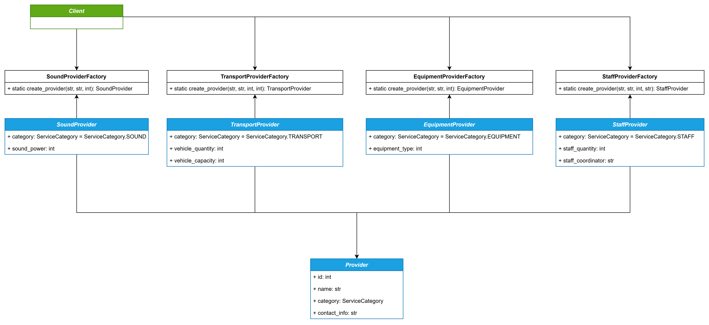
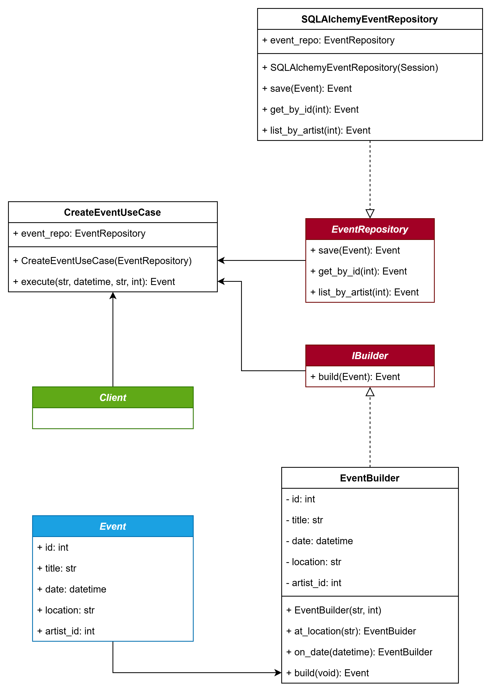
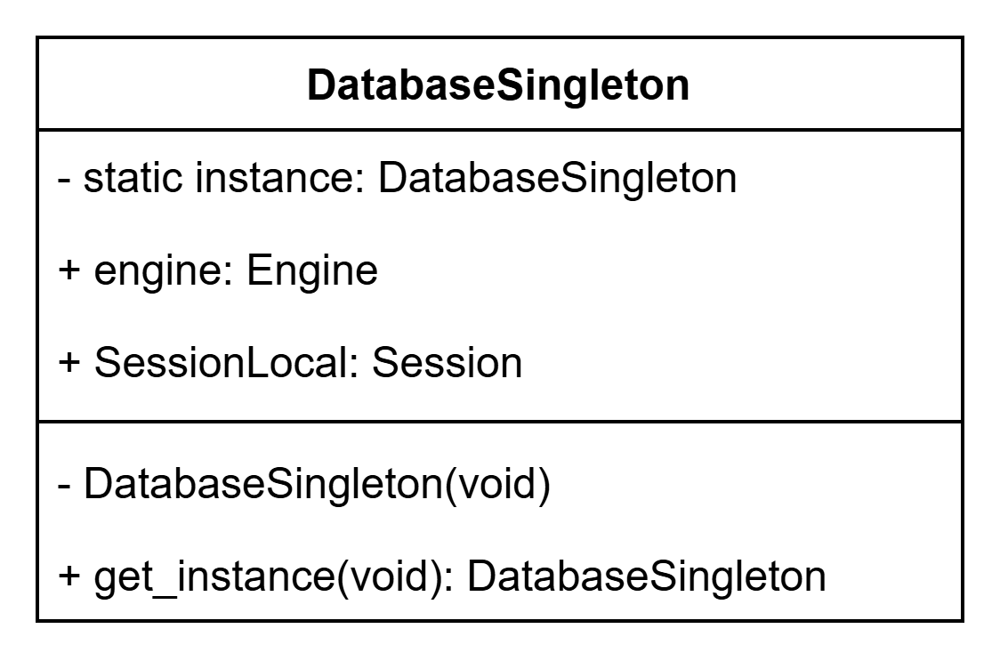
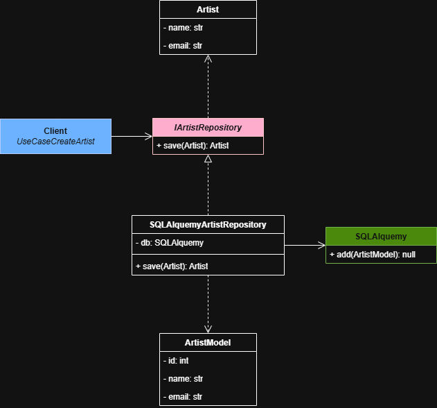
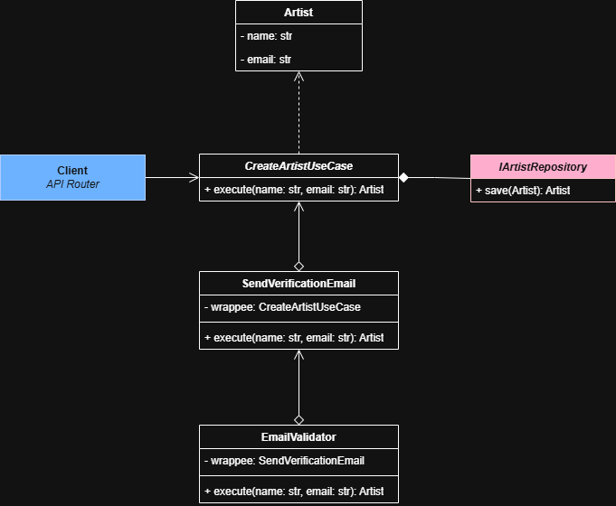

# Reto 2 - Patrones de diseño

Segundo reto del curso de Patrones de Diseño

## 📝 Autores

Juan Esteban García Cardona

Juan Pablo Lasprilla Correa

## 🔗 Repositorio

https://github.com/juanezcere/Reto-2---Patrones-de-dise-o

## 📌 Problemática

En Medellín, muchos artistas independientes enfrentan dificultades para organizar presentaciones, ya que deben coordinar múltiples actores (sonido, transporte, equipos,, personal), en procesos informales y fragmentados que limitan su circulación.

## 🔔 Reto

Crear una plataforma que permita a los artistas independientes coordinar de manera eficiente los recursos y actores necesarios para organizar sus presentaciones en la ciudad.

## 💻 Backend

### ⚒️ Arquitectura planteada

Replanteando la solución y teniendo en cuenta los tiempos de desarrollo con los que se cuentan, se propone realizar para el backend en lugar de una arquitectura basada en eventos, la cual sería ideal en un futuro, una arquitectura por capas hexagonal, ya que esta permite separar las abtracciones de las implementaciones fácilmente.

### 🟢 Ventajas

- Independencia de la tecnología. Se logra tener una independecia tanto de la base de datos o de cualquier tecnología presente en el sistema.

- Facilidad para la realización de pruebas. Al separar la lógica de dominio permite realizar pruebas unitarias sobre los casos de uso de una manera mucho más sencilla.

- Adaptabilidad a múltiples canales de entrada. El sistema puede admitir diferentes entradas sin necesidad de modificar las existentes.

- Foco en el lenguaje del dominio. Se permite ver claramente el dominio de la aplicación pues está separado claramente y los frameworks usados no interfieren en su visualización.

### 🔴 Desventajas

- Dificulta el código. Esto se evidencia al tener que escribir más clases al crear nuevas funcionalidades.

- Complejidad cognitiva. La complejidad cognitiva del software crece rápidamente por la cantidad de clases y saltos que se deben seguir para validar una funcionalidad.

- Sobrecarga en la gestión de dependencias. Se parte de la premisa de que el dominio no puede depender de nada externo, por lo que usar el patrón de inyección de dependencias se convierte en algo obligatorio al usar este tipo de arquitecturas hexagonales.

### Patrones de diseño creacionales

En el backend se implementan 3 patrones de diseño creacionales:

- Factory Method para la creación de proveedores de servicios. Se crea una clase que representa cada uno de los tipos de proveedores y luego se crea una fábrica para la creación de cada uno de ellos. Finalmente se modifica la fábrica creada por la IA para permitir llamar a la fábrica de cada proveedor. Esto permite estandarizar la creación de proveedores y como en este caso se crea una fabrica parametrizada solo tendrá que ser modificada la fábrica cuando se agreguen nuevos proveedores y no el caso de uso.

- Builder para la creación de eventos, este se implementa con la finalidad de reducir la cantidad de parámetros que se podrían configurar en un evento, con el uso de este patrón de diseño se consigue tener una facilidad en la extensión de los atributos para un evento y un constructor con muchos menos parámetros.

- Singleton para la instanciación de la base de datos. Se asegura que la conexión con la base de datos sea única en toda la aplicación sin tener una variable global. Esto también permite el ahorro de recursos pues no se crean varias instancias del mismo objeto.

### 🧾 Diagrama de clases

Eventos:

En el siguiente diagrama se observa la implementación de la fábrica realizada en el código. Siendo la fábrica ProviderFactory como el cliente en el diagrama, pues esta se encargará de llamar a la fábrica concreta según el parámetro enviado.



A continuación se presenta el diagrama de clases de la implementación del builder en el caso de los eventos.



Este por su parte es el diagrama de clases del singleton implementado en la base de datos.


### Patrones de diseño creacionales

### 🧾 Diagrama de clases

Diagrama de clases del adapter implementado en la base de datos


Diagrama de clases del patrón decorator implementado en las validaciones de email



### 📦 Database

Base de datos de tipo relacional. Inicialmente se crea con SQLite.

### 📁 Estructura de archivos

El código de backend se realizará en Python, con arquitectura hexagonal por capas con la siguiente estructura

1.  **Capa de Dominio (`src/domain/`)**:
    - Contiene las entidades de negocio (`Artist`, `Event`, `Provider`, `Booking`) y reglas fundamentales.
    - Es independiente de cualquier framework o base de datos.
2.  **Capa de Aplicación (`src/application/`)**:
    - **Puertos (`ports/`)**: Define interfaces (clases abstractas) para repositorios que la infraestructura debe implementar.
    - **Casos de Uso (`use_cases/`)**: Orquestan el flujo de datos. Ejemplo: `CreateEventUseCase` y `BookResourceUseCase`.
3.  **Capa de Infraestructura (`src/infrastructure/`)**:
    - **Adaptadores de DB**: Implementación de repositorios usando SQLAlchemy y SQLite.
    - **Adaptadores de API**: Controladores de FastAPI para exponer los servicios.
    - **Configuración**: Configuración de la base de datos e inyección de dependencias.

### 🛠 Ejecución

#### Requisitos

- Python 3.11+

#### Instalación y Uso

1. Crear y activar el entorno virtual:

```bash
python -m venv .venv
.\.venv\Scripts\Activate
```

2. Instalar dependencias:

```bash
pip install -r requirements.txt
```

3. Ejecutar la aplicación:

```bash
python main.py
```

La API estará disponible en `http://localhost:8000`.

4. Documentación interactiva:
   Se podrá visitar `http://localhost:8000/docs` para ver el Swagger UI.

### 📱 Frontend

Código de frontend en lenguaje de preferencia, distribuido en microservicios.
